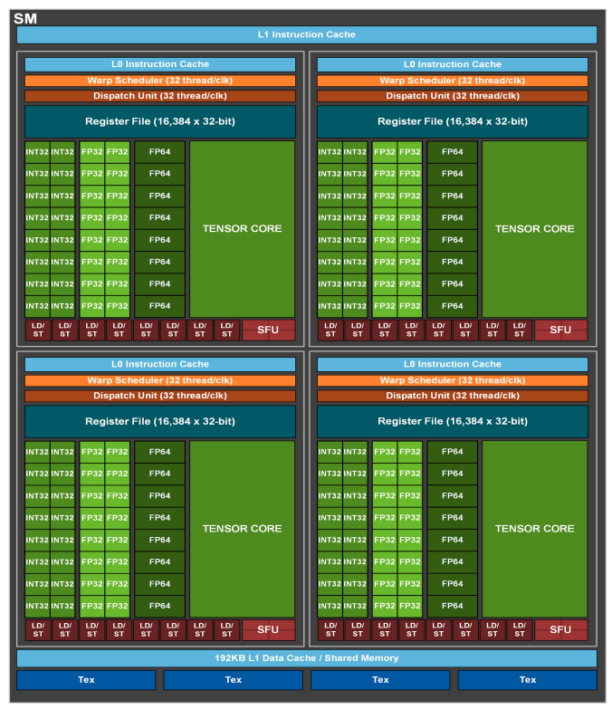

# Section 1 报告

## 术语表(先认硬件)

本报告后面会写到 **Load/Store Unit(LSU)**。它不是 CUDA 语言里的 API,也不是软件抽象类,而是 **GPU 芯片上真实存在的硬件执行单元**——和 INT32 / FP32 / Tensor Core 同级,专门干「在寄存器和各级存储器之间搬数据」。

| 术语 | 它是什么 | 一句话 |
|------|----------|--------|
| **SM**(Streaming Multiprocessor) | **硬件** | GPU 里一块可独立调度 warp 的大计算簇;下图整框就是一个 SM |
| **CUDA Core**(图里的 INT32/FP32 等) | **硬件** | 做普通算术的执行单元 |
| **Tensor Core** | **硬件** | 做矩阵乘加(`mma` 等)的专用执行单元 |
| **Load/Store Unit(LSU)** | **硬件** | 图里一排红色小块标成 **LD/ST** 的就是它;负责 load/store,`ldmatrix` 从 shared memory 读数据也要走这类通路 |
| **Shared Memory / L1 Data Cache** | **硬件** | SM 底部那块大容量片上存储;`__shared__` 和部分 L1 缓存在这里 |
| **ncu metric 名里的 `lsu`** | **计数器标签** | 例如 `...pipe_lsu...`,表示这条硬件计数器采的是 **经 Load/Store Unit 通路** 的事件,不是另发明了一个软件概念 |

对照下图(一张典型的 NVIDIA SM 结构示意;不同代际数量/容量会变,但「算术核旁边有一排 LD/ST,底下是 Shared Memory」这一层关系不变):



看图时盯三处即可:

1. 绿色 **TENSOR CORE / FP32 / INT32** → 算;
2. 同区底部红色 **LD/ST** → **Load/Store Unit**,搬数;
3. 整 SM 底部蓝色 **L1 Data Cache / Shared Memory** → 数从这儿经 LD/ST 进寄存器。

ASCII 把数据路径再缩成一条线:

```text
  寄存器堆 (Register File)
        ↑↓
  Load/Store Unit (图里的 LD/ST)   ← 硬件搬砖工,不是软件概念
        ↑↓
  Shared Memory / L1
        ↑↓
  (更远的) Global Memory …
```

本题 1.5 测的 wavefront / bank conflict,说的就是:**经 Load/Store Unit 去读 shared memory 时,因为 bank 布局好坏,这条硬件通路要串多少拍。**

---

# Section 1 · Problem 1.1 —— m16n8k32 e4m3 的 fragment 映射

> 配套代码:`cuda/m1_sm80/01_fragment_map.cu`
> 判测:`make run/m1_sm80/01_fragment_map`(纯 host)→ **PASS**

四个函数回答的是:给定 lane 和它手里第几个元素,这个元素落在 A/B 的哪一格。后面 1.3 的手工装载、1.4 的 `ldmatrix` 都直接用这套公式;映射错一处,随机数据上的 MMA 会算错。

---

## 1. 这条指令在算什么

```
mma.sync.aligned.m16n8k32.row.col.f32.e4m3.e4m3.f32
D[16×8] = A[16×32] × B[32×8] + C
```

- A:16 行(M) × 32 列(K),元素类型 e4m3
- B:32 行(K) × 8 列(N),元素类型 e4m3
- C/D:f32 累加

一个 warp 的 32 个 lane 合拿完整的 A 和 B。均分之后:

```
A:16×32 = 512 元素 / 32 lane = 每 lane 16 个元素 → 4 个 b32 寄存器
B:32×8  = 256 元素 / 32 lane = 每 lane  8 个元素 → 2 个 b32 寄存器
```

`i` 是 **这个 lane 手里第几个元素**,按寄存器打包顺序编号(A:0..15, B:0..7)。它标识 fragment 里的槽位。本题 e4m3 每个元素宽度恰好是 8 bit,所以「第几个元素」和「fragment 里第几个 8-bit 槽」数值重合;换 fp16 时每人仍按元素计数,只是每个元素占 16 bit。

一个 32-bit 寄存器能装 `32 / (元素位宽)` 个元素。e4m3 是 8 bit,所以每寄存器 **4** 个元素:

```
r = i / 4    第几个寄存器
j = i % 4    这个寄存器里第几格(0,1,2,3)
```

这里的 4 来自 **32 bit ÷ 8 bit**,和下面 lane 分组里的 4 是两件不同的事。

---

## 1.1 `gid` / `tig` 里的 4 从哪来

指令形状是 **m16n8k32**:D 和 B 的 N 维是 **8 列**。32 个 lane 要覆盖这 8 列:

```
32 个 lane / 8 列 = 每列 4 个 lane
```

硬件把 32 个 lane 编成 **8 组、每组 4 人**,组内 4 人合管 B 的同一列(也合管 A 的同一组行):

```
列 n=0:  lane  0, 1, 2, 3
列 n=1:  lane  4, 5, 6, 7
…
列 n=7:  lane 28,29,30,31
```

所以:

```
gid = lane / 4     我在第几组 = 我管 B 的哪一列 n(0..7)
tig = lane % 4     我在组里是第几人(0..3)
lane = gid * 4 + tig
```

这个 4 来自 **`32 / N`**,而 N=8 写在指令名的 `n8` 里。课上 m16n8k16 fp16 的图是同一套分组:T0–T3 管 B 的第 0 列,T4–T7 管第 1 列。dtype 和 K 变了,N 仍是 8,所以仍是除以 4、对 4 取余。

A 用同一套分组,角色对调一下:

- `gid`(0..7)对应半边 8 行里的哪一行(`M=16` 切成上下各 8 行,所以 gid 到 7)
- `tig`(0..3)对应这一行上,K 被切成的第几段

K 半边宽度 ÷ 每寄存器沿 K 装的元素数,也等于 4(本题 16/4=4;课上 fp16 是 8/2=4)。所以 A 的「一行半边要 4 个人」和 B 的「一列要 4 个人」是同一个 4,都锁在 `m16n8` 这个形状上。

---

## 2. 公式:从课上 k16 fp16 改两个常数

课上 m16n8k16 fp16 的图(四象限,每个寄存器沿 K 跨 2 个元素,右半 +8):

```
A:  row = gid + 8 * (r % 2)
    col = 2 * tig + 8 * (r / 2)

B:  n = lane / 4
    k = 2 * (lane % 4) + 8 * r
```

本题 K=32、每寄存器沿 K 装 4 个 e4m3,所以跨度 2→4、半边 8→16,再写出寄存器内第几格 `j`:

```
A:  row = gid + 8 * (r % 2)
    col = 4 * tig + 16 * (r / 2) + j

B:  n = lane / 4
    k = 4 * (lane % 4) + 16 * r + j
```

A 的四个寄存器对应四个象限:`r=0` 左上,`r=1` 左下,`r=2` 右上,`r=3` 右下。B 两个寄存器对应一列的上半 K / 下半 K。

实现见 `01_fragment_map.cu`。host 真值表用 `row*32+col`(A)和 `k*8+n`(B)把一对坐标收成一个整数再比对,比的是格子位置。

---

## 3. 附加问题

> A 的同一个 b32 寄存器中的 4 个 fp8 元素沿矩阵哪个方向相邻?
> 这个布局对 1.4 中使用 ldmatrix load 有什么影响?

### 3.1 结论

**沿 K 相邻。** A 上是同一行连续 4 列;B 上是同一列连续 4 行。换行、换左右半、换 n,都发生在不同寄存器之间。

### 3.2 从公式读出相邻方向

把 A 的公式里 `r` 钉死(同一个寄存器),只让 `j` 走 0,1,2,3:

```
row = gid + 8*(r%2)                 ← 不含 j,四个元素行号相同
col = 4*tig + 16*(r/2) + j          ← 只在 col 上 +0,+1,+2,+3
```

这四格是 `(同一行, 起始列+0/1/2/3)`。A 的列就是 K。

lane 0 的四个寄存器:

```
a[0]  j=0..3 → A[0][0..3]
a[1]  j=0..3 → A[8][0..3]     另一行,仍沿 K 走 4 格
a[2]  j=0..3 → A[0][16..19]
a[3]  j=0..3 → A[8][16..19]
```

B:钉死 `r` 之后 `n = lane/4` 固定,`k = 4*tig + 16*r + j` 只在 k 上连走 4 步,同样沿 K。

MMA 沿 K 做内积,寄存器里打包的就是这段 K。课上 fp16:一个寄存器跨 2 个 K;e4m3 每个元素 8 bit,同样 32 bit 跨 **4 个 K**。

### 3.3 这对 1.4 的 ldmatrix 意味着什么

`ldmatrix` 的接口是:

- 每条「行地址」指向 **16 byte 连续** 的一段 smem
- 搬移单位是 **b16**(16 bit)。e4m3 下,两个沿 K 的元素合成一个 b16,四个合成一个 b32
- `.x1/.x2/.x4` 决定每个 lane 拿到几个 b32;`.trans` 决定这 16 byte 按哪条轴灌进寄存器

1.1 的打包方向接到这条接口上,有三件具体的事。

**(1) 沿 K 相邻,和「16 byte 连续行」对齐的方式。**

A 按 `[16][32]` 行主序放 smem 时,一行就是 K 方向 32 个连续元素:

- 一个 b32 要的 4 个元素 = 一行上连续 4 格
- 一条 ldmatrix 行地址要的 16 byte = 一行上连续 16 个 K,覆盖「左半或右半」一整段(`col` 公式里的 `+16*(r/2)`)

A 用行主序 smem、配合 `ldmatrix` 的默认轴,「16 byte 连续行」就对上「沿 K 打包的 fragment」。手工路径里按公式算 `A[row*32+col]` 的那一大段地址算术,会被这次集体搬移消掉——这是 1.4 要数指令的原因。

**(2) B 要用能让 K 连续的 smem 布局,所以 1.4 备了 `sBn`。**

B 的 fragment 同样要沿 K 的 4 个相邻元素进同一个 b32。`[32][8]` 的 k-major 下,固定 n、k 加 1,步长是 8 个元素,沿 K 的邻居在内存里是跳着的;ldmatrix 的行地址要的是步长为 1 的 16 byte,两者要靠把 K 摆成连续维才能合上。

转成 n-major `[8][32]`:每个 n 的 32 个 k 变成连续 32 个元素。沿 K 相邻 = 这一行里连续的元素,ldmatrix 的 16 byte 行地址成立。文件头说「B 的 fragment 需要 k 方向相邻的元素成对进 b16」:b16 是 ldmatrix 的原子,两个沿 K 的 e4m3 合成一个 b16;布局要让这些 K 向邻居在 smem 里贴在一起。

**(3) `.trans` 选的是轴,要和「沿 K 打包」一致。**

`.trans` 把连续 16 byte 解释成另一条轴。A 已经是 K 向连续、fragment 也要 K 向打包,用直搬(无 `.trans`)即可。B 在 n-major 下 K 已经是连续维,同样用直搬。骨架提供 `sBn`,就是把 K 摆成连续维,让 ldmatrix 的行地址直接对上 fragment。

一句话:**fragment 规定「一个寄存器吃一段 K」;ldmatrix 规定「一次搬 16 个连续 byte」。两边对齐时,smem 的连续维是 K。** 1.1 把相邻方向钉死之后,1.4 的布局和 `.trans` 就有了选择依据。

---

# Section 1 · Problem 1.2 —— m16n8k16 fp16：A 下半行装错了会怎样

> 配套代码:`cuda/m1_sm80/02_bug_fragment.cu`
> 判测:`make ARCH=120a bin/m1_sm80/02_bug_fragment && srun -p lcpu-infra --gpus=1 ./bin/m1_sm80/02_bug_fragment`
> 修好后 → **PASS**(仓库里当前版本已修)

`m16n8k16` fp16 MMA。B 的装载和 D 的写回都是对的;bug 只在 A 的下半行。对着下面两段代码看就够了。

---

## 1. 错的 vs 对的

四象限提醒:`a0,a1` / `a4,a5` 管行 `group`;`a2,a3` / `a6,a7` 管行 `group+8`。

**原来(错):**`a2,a3,a6,a7` 又读了一遍上行,漏了 `(group+8)`。

```
a0 = A[group * 16 + tig * 2];
a1 = A[group * 16 + tig * 2 + 1];
a2 = A[group * 16 + tig * 2];          // 错
a3 = A[group * 16 + tig * 2 + 1];      // 错
a4 = A[group * 16 + tig * 2 + 8];
a5 = A[group * 16 + tig * 2 + 9];
a6 = A[group * 16 + tig * 2 + 8];      // 错
a7 = A[group * 16 + tig * 2 + 9];      // 错
```

**修好(对):**只有这四行改成 `(group + 8) * 16 + …`,其余不动。

```
a0 = A[group * 16 + tig * 2];
a1 = A[group * 16 + tig * 2 + 1];
a2 = A[(group + 8) * 16 + tig * 2];
a3 = A[(group + 8) * 16 + tig * 2 + 1];
a4 = A[group * 16 + tig * 2 + 8];
a5 = A[group * 16 + tig * 2 + 9];
a6 = A[(group + 8) * 16 + tig * 2 + 8];
a7 = A[(group + 8) * 16 + tig * 2 + 9];
```

差就差在:`a2,a3,a6,a7` 的行号是不是 `group+8`。

---

## 2. (a) 症状

跑 buggy 版本:

- `D` 上半行 `0..7` 全对
- 下半行 `8..15` 整块等于上半:`got[r+8][n] == got[r][n]`
- 相对 ref 大约 `59/128` 个 mismatch(少数格碰巧 `A[r]·B == A[r+8]·B`)

host 故意让 A 上下半不同,所以「下行装成上行」会在 D 上直接变成复印件。

---

## 3. (b) 为什么是这个症状

`d0,d1` 写 `D[group][…]`,靠的是上行 A(`a0,a1,a4,a5`)→ 上半对。  
`d2,d3` 写 `D[group+8][…]`,靠的是下行 A(`a2,a3,a6,a7`)→ 错装成上行之后,算出来的正好是 `D[group]` 那一份,所以下半 = 上半。

---

## 4. D 写回长什么样(顺手对照)

K 在 MMA 里已经消掉了;每 lane 4 个 f32 是 4 个算完的 `D[m][n]`:

```
d[0], d[1]  →  同一行、相邻两列
d[2], d[3]  →  行号 +8、同样两列
```

```
D[group * 8 + tig * 2]           = d[0];  // 行 group,   列 tig*2
D[group * 8 + tig * 2 + 1]       = d[1];
D[(group + 8) * 8 + tig * 2]     = d[2];  // 行 group+8, 列 tig*2
D[(group + 8) * 8 + tig * 2 + 1] = d[3];
```

固定某个 `group`,`tig=0..3` 四人合起来:

```
        列 0,1    2,3    4,5    6,7
行 g      tig0   tig1   tig2   tig3     ← d0,d1
行 g+8    tig0   tig1   tig2   tig3     ← d2,d3
```

---

# Section 1 · Problem 1.4 —— ldmatrix

> 配套代码:`cuda/m1_sm80/04_ldmatrix.cu`
> 判测:两条路径各跑 3 个 seed(1,7,42),全 PASS 才算过
> 运行:
> ```
> cd assignment02/cuda
> make ARCH=120a bin/m1_sm80/04_ldmatrix && srun -p lcpu-infra --gpus=1 ./bin/m1_sm80/04_ldmatrix
> ```

## 0. 矩阵形状

```
mma.sync.aligned.m16n8k32.row.col.f32.e4m3.e4m3.f32
D[16×8] = A[16×32] × B[32×8] + C
```

| 矩阵 | 形状 | smem |
|------|------|------|
| A | 16×32 e4m3 | `sA` 行主序 |
| B | 32×8 e4m3 | `sBn` n-major(本题 ldmatrix 用这个) |
| D | 16×8 f32 | 写回 global |

`load_ldsm` 的工作:从 smem 把 A、B 装进每个 lane 的 `a[0..3]`、`b[0..1]`,布局对齐课上的 fragment 四色图,然后发 `mma`。

---

## 1. ldmatrix 在干什么

写法跟课上一致:每个 lane 提供一个 8×8(以 b16 计)小矩阵某一行的首地址;指令读行并按 fragment 图写入寄存器。

### 1.1 对着四色图

| lane | 色块 | 寄存器 | 行首 |
|------|------|--------|------|
| 0..7 | 绿左上 | `a[0]` | `&sA[row*32 + 0]`,row=0..7 |
| 8..15 | 紫左下 | `a[1]` | `&sA[row*32 + 0]`,row=8..15 |
| 16..23 | 蓝右上 | `a[2]` | `&sA[row*32 + 16]`,row=0..7 |
| 24..31 | 橙右下 | `a[3]` | `&sA[row*32 + 16]`,row=8..15 |

蓝 / 橙的行首在 **K 右半**(`col=16` 起的 16 byte)。绿 / 紫在 `col=0`。

课上 fp16、K=16 是 `col = (lane>>4)*8`、stride 16;本题 e4m3、K=32 半段仍是 16 byte,改成 `*16`、stride 32,结构相同。

### 1.2 代码(课上模板,本题用 `/` `%`)

```
lane = threadIdx.x % 32
row  = lane % 16
col  = (lane / 16) * 16
aAddr = __cvta_generic_to_shared(&sA[row * 32 + col])
ldmatrix.x4 → a[0..3]

n = lane % 8
k = ((lane / 8) % 2) * 16
bAddr = __cvta_generic_to_shared(&sBn[n * 32 + k])
ldmatrix.x2 → b[0..1]
```

---

## 2. 数据从哪到哪

```
global → smem(sA, sBn) → ldmatrix → 寄存器 a[]/b[] → mma → d[] → global
```

`ldmatrix` = load from shared memory:从 smem 读进寄存器。

B 用 `sBn`(n-major):每个 n 的 K 连续,才能取出 16 byte 的一行。`sBk` 沿 K 步长是 8,拼不成这种行。

---

## 3. PTX 对照(报告两问的证据)

文件:`make ARCH=120a ptx/m1_sm80/04_ldmatrix` → `m1_sm80/04_ldmatrix.ptx`  
口径:**`bar.warp.sync` 之后、`mma.sync` 之前**(拷贝循环、写回 D、C 清零的 `mov.f32` 都不算)。

- **装载** = `ld.shared.*` / `ldmatrix.*`
- **地址算术** = 从 `%tid.x`(`%r1`)算出 smem 字节偏移再加到基址的 `shl`/`and`/`or`/`add`(基址 `mov.u32 sA/sBn` 单独记,不进算术条数)

`mma_kernel<true>` = ldmatrix,`mma_kernel<false>` = 手工。

### 3.1 手工路径(`$L__BB1_6`)

```
bar.warp.sync  -1;
shl.b32  %r22, %r1, 3
and.b32  %r23, %r22, 8160      // gid*32 相关
shl.b32  %r24, %r1, 2
and.b32  %r25, %r24, 12        // 4*tig 相关
or.b32   %r26, %r23, %r25      // offset = gid*32 + 4*tig
mov.u32  %r27, sA
add.s32  %r28, %r27, %r26
ld.shared.u32  %r16, [%r28]        // a[0] 左上
ld.shared.u32  %r17, [%r28+256]    // a[1] 左下  (+8 行 = 256B 折进立即数)
ld.shared.u32  %r18, [%r28+16]     // a[2] 右上  (+16 列)
ld.shared.u32  %r19, [%r28+272]    // a[3] 右下
mov.u32  %r29, sBn
add.s32  %r30, %r29, %r26          // B 复用同一 offset
ld.shared.u32  %r20, [%r30]        // b[0]
ld.shared.u32  %r21, [%r30+16]     // b[1]
mma.sync.aligned.m16n8k32.row.col.f32.e4m3.e4m3.f32
    {%f1,%f2,%f3,%f4}, {%r16,%r17,%r18,%r19}, {%r20,%r21}, {%f8,%f8,%f8,%f8};
```

| 类 | 条数 | 明细 |
|----|------|------|
| 装载 | **6** | 6× `ld.shared.u32` |
| 地址算术 | **7** | 5 条算 `%r26` + 2 条 `base+offset` |
| 基址 mov | 2 | `sA`、`sBn` |

六个 b32(A 四象限 + B 两半区)各对应一条 `ld.shared`;`+256/+16/+272` 是编译器把固定象限位移折进寻址立即数。

### 3.2 ldmatrix 路径(`$L__BB0_6`)

```
bar.warp.sync  -1;
and.b32  %r30, %r1, 16
shl.b32  %r31, %r1, 5
and.b32  %r32, %r31, 480
or.b32   %r33, %r32, %r30       // A: row*32 + col 的偏移
mov.u32  %r34, sA
add.s32  %r20, %r34, %r33
ldmatrix.sync.aligned.m8n8.x4.shared.b16 {%r16,%r17,%r18,%r19}, [%r20];
shl.b32  %r35, %r1, 1
and.b32  %r36, %r35, 16
and.b32  %r37, %r31, 224        // 复用上面的 %r31
or.b32   %r38, %r37, %r36       // B: n*32 + k 半区
mov.u32  %r39, sBn
add.s32  %r23, %r39, %r38
ldmatrix.sync.aligned.m8n8.x2.shared.b16 {%r21,%r22}, [%r23];
mma.sync.aligned.m16n8k32.row.col.f32.e4m3.e4m3.f32
    {%f1,%f2,%f3,%f4}, {%r16,%r17,%r18,%r19}, {%r21,%r22}, {%f8,%f8,%f8,%f8};
```

| 类 | 条数 | 明细 |
|----|------|------|
| 装载 | **2** | 1× `.x4` + 1× `.x2` |
| 地址算术 | **10** | A:4 算偏移+1 `add`;B:4 算偏移+1 `add`(`%r31` 两边共用) |
| 基址 mov | 2 | `sA`、`sBn` |

`.x4` 写出 `{%r16,%r17,%r18,%r19}` = `a[0..3]`;`.x2` 写出 `{%r21,%r22}` = `b[0],b[1]`。两条路径的 `mma` 都从这六个寄存器取操作数。

### 3.3 对照表

| 路径 | 装载指令 | 地址计算指令 |
|------|----------|--------------|
| 手工 | **6** (`ld.shared.u32`) | **7** |
| ldmatrix | **2** (`ldmatrix` ×2) | **10** |

### 3.4 报告两问

**(a) `ldmatrix` 省掉了手工装载中的哪些工作?**

对照 `bar.warp.sync` 到 `mma.sync` 之间的装载指令。

手工路径是下面 6 条,每条只填本 lane 的一个 b32:

```
ld.shared.u32  %r16, [%r28]         → a[0]
ld.shared.u32  %r17, [%r28+256]     → a[1]
ld.shared.u32  %r18, [%r28+16]      → a[2]
ld.shared.u32  %r19, [%r28+272]     → a[3]
ld.shared.u32  %r20, [%r30]         → b[0]
ld.shared.u32  %r21, [%r30+16]      → b[1]
```

ldmatrix 路径变成下面 2 条:

```
ldmatrix.sync.aligned.m8n8.x4.shared.b16 {%r16,%r17,%r18,%r19}, [%r20]
    → 一次写出 a[0], a[1], a[2], a[3](四个色块)

ldmatrix.sync.aligned.m8n8.x2.shared.b16 {%r21,%r22}, [%r23]
    → 一次写出 b[0], b[1](两个 K 半区)
```

**变成了什么:** 装载从 6 条 `ld.shared.u32` 变成 1 条 `ldmatrix...x4` 加 1 条 `ldmatrix...x2`。

**省了什么:** 按 fragment 寄存器逐个从 smem 取数(那 6 次 `ld.shared`)。

**没有省什么:** 算地址。手工路径地址算术 7 条(算出 `%r26`,再加到 `sA`/`sBn`);ldmatrix 路径地址算术 10 条(算出行首 `%r20`、`%r23`)。每个 lane 仍要提供自己那条 16 byte 行的起点;手工里 `%r28+256`、`%r28+16`、`%r28+272` 那种立即数折算,在 `ldmatrix` 的 `[%r20]` / `[%r23]` 上用不上。

**(b) 为什么这些工作在手工路径里绕不开?**

`ld.shared.u32 %rdst, [%addr]` 的含义是:从本 lane 的 `%addr` 读 4 个 byte,写进本 lane 的 `%rdst`。A 要 4 个 b32、B 要 2 个 b32,一共 6 次读,所以手工 PTX 里必须有那 6 条 `ld.shared.u32`。普通 shared load 做不到「一次读多行,再按 fragment 图写到各 lane 的多个寄存器」。

`ldmatrix.sync.aligned.m8n8.x4.shared.b16 {%r16,%r17,%r18,%r19}, [%r20]` 的含义是:warp 内各 lane 交出各自的 16 byte 行首 `%r20`,硬件读行并按 fragment 图写入 `%r16,%r17,%r18,%r19`。  
`ldmatrix.sync.aligned.m8n8.x2.shared.b16 {%r21,%r22}, [%r23]` 同理写出 `%r21,%r22`。

写完之后发 MMA。手工路径:

```
mma.sync.aligned.m16n8k32.row.col.f32.e4m3.e4m3.f32
    {%f1,%f2,%f3,%f4}, {%r16,%r17,%r18,%r19}, {%r20,%r21}, {%f8,%f8,%f8,%f8}
```

ldmatrix 路径:

```
mma.sync.aligned.m16n8k32.row.col.f32.e4m3.e4m3.f32
    {%f1,%f2,%f3,%f4}, {%r16,%r17,%r18,%r19}, {%r21,%r22}, {%f8,%f8,%f8,%f8}
```

两边都是从六个 fragment 寄存器取 A、B(B 的物理寄存器号不同:`%r20,%r21` 对 `%r21,%r22`,角色相同)。没有 `ldmatrix` 时,只能继续用 6 条 `ld.shared.u32`(或自己 load 再 shuffle)把数据装进这些寄存器,装载条数跟着 fragment 寄存器个数走。这就是手工路径绕不开那 6 条 `ld.shared` 的原因。

---

## 4. 小结

```
发 mma 前:两个路径的 a[0..3]、b[0..1] 都已是 fragment 布局
手工 PTX:6× ld.shared.u32 + 7 条地址算术
ldmatrix PTX:1× .x4 + 1× .x2 + 10 条地址算术
省的是装载条数(6→2),不是算行首
```

---

# Section 1 · Problem 1.5 —— 行跨度与 ldmatrix 的 bank conflict

> 配套代码:`cuda/m1_sm80/05_ldsm_stride.cu`(程序不用改)
> GPU:RTX 5090(`gj-5090-1`,CC 12.0),`ARCH=120a`
>
> 本题要练两件事:(1) 用 bank 模型先预测;(2) 用程序计时 + **Nsight Compute (`ncu`)** 拿硬件计数器交叉验证。结论要有数,也要会留「我怎么测到的」痕迹。

---

## 0. 集群上怎么跑:登录节点 vs GPU 节点

你 `ssh` 上去默认站在 **登录节点**(`slurm-login`)。它是一台普通 Linux:有文件系统、编译器、`srun`,但 **通常没有可用的 GPU 驱动/设备**(在上面直接跑 CUDA 二进制常会 `cudaErrorInsufficientDriver`)。

要跑 kernel / `ncu`,需要向调度器要一台 **计算节点**,并把命令放到那台机器上执行:

```bash
cd ~/ai-infra/wmhpc-training-camp-x-lcpu-ai-infra-seminars/assignment02/cuda

# 编译(建议在计算节点上 make,避免登录节点与计算节点看到的 bin 不同步)
srun -p lcpu-infra --gpus=1 bash -lc \
  'cd '"$PWD"' && make ARCH=120a -B bin/m1_sm80/05_ldsm_stride'

# 只看程序自己的 cycle
srun -p lcpu-infra --gpus=1 bash -lc \
  'cd '"$PWD"' && ./bin/m1_sm80/05_ldsm_stride'

# 用 ncu 看 shared load 的 wavefront / bank conflict
srun -p lcpu-infra --gpus=1 bash -lc \
  'cd '"$PWD"' && ncu --metrics \
    l1tex__data_pipe_lsu_wavefronts_mem_shared_op_ld.sum,\
l1tex__data_bank_conflicts_pipe_lsu_mem_shared_op_ld.sum \
    ./bin/m1_sm80/05_ldsm_stride'
```

技能点:**登录节点 = 写代码 / 提交作业的前门;GPU 在计算节点上,用 `srun`/`sbatch` 进去用。** `ncu` 也必须在有 GPU 的节点上跑,并且对「当前目录下的二进制」要用 `cd` 后再写相对路径。

---

## 1. 题目在问什么

同一个 **16×16 fp16** tile 用 `ldmatrix.m8n8.x4` 从 smem 装进 fragment。变的只有 **行跨度** `STRIDE`(相邻两行起点相距多少 byte)。可以把它想成:大矩阵按某种行宽躺在 smem 里,我们每次只读左上角那块 16×16。

| `STRIDE` | 原始大矩阵怎么躺 | 我们读的子块 | 行与行的地址关系 |
|----------|------------------|--------------|------------------|
| **32 B** | 原始就是 16×16,每行正好 32 字节,连续存放 | 就是整个矩阵 | 第 `r` 行地址 = `r × 32`,下一行紧跟上一行,没有空隙 |
| **64 B** | 更宽的矩阵,每行 64 字节(例如宽 32 列 fp16);我们只取前 16 列 | 16 行 × 前 16 列 | 第 `r` 行地址 = `r × 64`,下一行要跳过中间 32 字节「没用到的列」 |
| **128 B** | 每行 128 字节(例如宽 64 列 fp16);我们只取前 16 列 | 16 行 × 前 16 列 | 第 `r` 行地址 = `r × 128`,下一行要跳过中间 96 字节 |
| **144 B** | 每行 128 字节内容再加 **16 字节空白 padding**;我们仍只取前 16 列 | 16 行 × 前 16 列 | 第 `r` 行地址 = `r × 144`,行尾多 16 字节空档,用来错开 bank |

kernel:**8 个 warp** 同发、各用自己的 smem 区,循环 `ITERS=4096` 次 `ldmatrix`,打印均摊 cycle;再用 `ncu` 数 shared **load** 的 wavefront 与 bank conflict。

本题要看的是:**同一条 `ldmatrix`、同一块 16×16 tile,只改行跨度时,bank conflict 会怎样拖慢它。**

---

## 2. Profiling 技能树:`ncu` 是什么、本题两个计数器是什么

### 2.1 程序自己的 cycle vs `ncu`

| 手段 | 看到什么 | 看不到什么 |
|------|----------|------------|
| `clock64()` 包住循环(本题程序自带) | 「这段代码大概花了多少拍」 | 为什么慢(是算力、是 smem、还是别的) |
| `ncu --metrics ...` | 硬件管道上的**具名事件计数** | 需要你自己选对 metric、会读表 |

两者要一起看:cycle 说「有多痛」,metric 说「痛在哪条管子上」。

### 2.2 Nsight Compute(`ncu`)本质上干什么

`ncu` 是 NVIDIA 的 **kernel 级性能分析器**。它会:

1. 启动你的进程,在每次 GPU kernel launch 时插入采集;
2. 按你点名的 **metric** 在硬件/驱动计数器上累加;
3. 按「每一次 kernel 调用」打一份表(本题每个 `STRIDE` 会 launch 两次:warmup + 正式,所以同名 kernel 出现两份相同数字)。

本题只要 shared memory **读** 路径上的两个量:

| Metric 全名 | 口语 | 含义 |
|-------------|------|------|
| `l1tex__data_pipe_lsu_wavefronts_mem_shared_op_ld.sum` | **wavefronts** | shared **load** 经 **Load/Store Unit** 通路发出的 wavefront 总数。同一 bank 被多人挤时,一次逻辑访问会拆成多拍 → 这个数变大 |
| `l1tex__data_bank_conflicts_pipe_lsu_mem_shared_op_ld.sum` | **bank conflicts** | 上述通路上统计到的 **bank conflict** 次数。无冲突布局应接近 **0** |

(名字里的 `lsu` = Load/Store Unit;见文首术语表与 SM 结构图里的红色 **LD/ST**。)

读表口诀:

- 先看 **四个 `STRIDE` 的 wavefront 比值**是否像 bank 模型(本题期望 2:4:8:1);
- 再看 **conflict**:padding 档应接近 0;
- 最后才拿程序打印的 **cycle** 对比「墙钟比是否远小于 wavefront 比;8 warp 是否比 1 warp 更能让最差布局露头」(见 §6 实测)。

---

## 3. 先预测:bank 模型

约定:

- smem **32 bank**,每 bank **4 byte**;bank = `(字节地址 / 4) % 32`
- 同一小块里 8 个 lane 各交一条 16 byte 行首;起点挤在同一组 bank → 多 wavefront

代码里(忽略每 warp 基址):

```
row  = lane % 16
half = lane / 16
addr = row * STRIDE + half * 16
```

一个色块内 8 行起点 `r * STRIDE`(`r=0..7`):

| `STRIDE` | 起点 bank `(r*STRIDE/4)%32` | 撞车程度 | 相对无冲突的预测 |
|----------|-----------------------------|----------|-------------------|
| 32 | 0,8,16,24 循环 | 2 路 | **2×** |
| 64 | 0,16 循环 | 4 路 | **4×** |
| 128 | 全是 0 | 8 路 | **8×** |
| 144 | 0,4,8,…,28 | 8 行互不撞 | **1×** |

`128 B` 在本模式最差:`128/4=32`,行距刚好绕完一圈 bank,每行起点又回到 0。`+16` padding 错开起点。题面「增加到 **4 倍**」相对无冲突基线 → **64 B**。

冲突域按 **每个 m8n8 小块的 8 行** 看:144B 在单块内无起点碰撞;ncu 上 conflict 可为 0(不要把 16 行揉成同一拍再硬说「还有 2 路」)。

---

## 4. 原汁原味实测输出(5090)

下面是计算节点上一次完整 `ncu` 跑的摘录(与你终端一致)。程序在 profiling 过程中仍会打印 cycle 行。

### 4.1 程序打印的 cycle

```text
stride 32B        9.93 cycles / ldmatrix(8 warp 均摊)
stride 64B       10.91 cycles / ldmatrix(8 warp 均摊)
stride 128B      16.07 cycles / ldmatrix(8 warp 均摊)
stride 128B+pad   9.41 cycles / ldmatrix(8 warp 均摊)
```

### 4.2 `ncu` 表头在说什么

```text
==PROF== Connected to process .../05_ldsm_stride
==PROF== Profiling "ldsm_kernel" - 0: ... 100% - 1 pass
...
==PROF== Profiling "ldsm_kernel" - 7: ... 100% - 1 pass
```

- `ldsm_kernel` 出现 **0..7 共 8 次 pass**:四个 `STRIDE` ×(warmup + 正式)各一次。
- 每一段标题形如 `void ldsm_kernel<32>(...)`:`<32>` 就是模板参数 `STRIDE`。

### 4.3 四档计数器(每档两份相同,这里各留一份)

**`STRIDE=32`**

```text
void ldsm_kernel<32>(...)
  l1tex__data_bank_conflicts_pipe_lsu_mem_shared_op_ld.sum          8192
  l1tex__data_pipe_lsu_wavefronts_mem_shared_op_ld.sum             16384
```

**`STRIDE=64`**

```text
void ldsm_kernel<64>(...)
  l1tex__data_bank_conflicts_pipe_lsu_mem_shared_op_ld.sum         24576
  l1tex__data_pipe_lsu_wavefronts_mem_shared_op_ld.sum             32768
```

**`STRIDE=128`**

```text
void ldsm_kernel<128>(...)
  l1tex__data_bank_conflicts_pipe_lsu_mem_shared_op_ld.sum         57344
  l1tex__data_pipe_lsu_wavefronts_mem_shared_op_ld.sum             65536
```

**`STRIDE=144`(128B+pad)**

```text
void ldsm_kernel<144>(...)
  l1tex__data_bank_conflicts_pipe_lsu_mem_shared_op_ld.sum             0
  l1tex__data_pipe_lsu_wavefronts_mem_shared_op_ld.sum              8192
```

### 4.4 汇总表(题面要填的)

以 pad 的 8192 wavefront 为 **1×**:

| 档位 | 预测比 | 实测 wavefront | 实测 conflict | 平均 cycle | 实测比 |
|------|--------|----------------|---------------|------------|--------|
| 32 B | 2× | 16384 | 8192 | 9.93 | **2×** |
| 64 B | 4× | 32768 | 24576 | 10.91 | **4×** |
| 128 B | 8× | 65536 | 57344 | 16.07 | **8×** |
| 128+16 B | 1× | 8192 | **0** | 9.41 | **1×** |

预测与 ncu **一致**。cycle 从 9.4→10.9→16,远小于 1:4:8。下面两节分别把 **8192 从哪来** 和 **cycle 为何不跟乘** 算清楚。

---

## 5. 8192 / 16384 / … 怎么从第一性原理推出来

### 5.1 两个计数器的单位是什么

两条 metric 都是 **一次 kernel launch 内的累加次数**(`.sum`),单位不是「秒」,也不是「每个 bank 被点了几次」的抽象分数,而是经 **Load/Store Unit** 的 shared **读** 在硬件上产生的 **wavefront 事件**:

| 计数器 | 单位(口语) | 硬件在数什么 |
|--------|------------|--------------|
| `...wavefronts_mem_shared_op_ld` | **shared load wavefront 数** | 这条 shared **读** 经 Load/Store Unit 实际发出了多少个 wavefront(含因冲突而串行重放的) |
| `...bank_conflicts_..._shared_op_ld` | **多余的 wavefront 数** | 相对「同一种访问在无冲突时最少需要多少 wavefront」,多出来的那些拍 |

NVIDIA 对这类 metric 的口径就是:

```text
bank_conflicts ≈ wavefronts − wavefronts_ideal
```

一拍(一个 wavefront)最多吃满 **32 bank × 4 B = 128 B**。同一拍里若多个请求挤进**同一个 bank 的不同字**,硬件只能拆成多拍 → `wavefronts` 变大,多出来的记进 `bank_conflicts`。

### 5.2 代码里一次正式 launch 在干什么

看 `05_ldsm_stride.cu` 里被 `ncu` 采到的那次(warmup 另一次,数字相同,取一份即可):

- `<<<1, 256>>>` → **1 个 block、8 个 warp**
- 每个 warp 循环 **`ITERS = 4096`** 次 `ldmatrix.sync.aligned.m8n8.x4`
- 每个 warp 有自己的 smem 区,但 **访问模式相同**(只是基址不同)

`ldmatrix.m8n8.x4` 要搬完 **16×16 fp16 = 512 B**。地址由 32 个 lane 各交一个 **16 B 行首**(代码里 `row*STRIDE + half*16`)。冲突分析按课上模型:**每次真正抢 bank 的是一个 8 行小块**(8 个 16 B 行首 = 128 B)。无冲突时,这 128 B 正好是 **1 个 wavefront** 的满载;有 N 路起点撞车,这一个小块就要 **N 个 wavefront**。

一次 `.x4` 覆盖 16 行,自然拆成 **上下两个 8 行小块**(再加左右 half 的打包;对本题行首 bank 碰撞,决定倍数的仍是「每个 8 行块里起点撞几路」)。

### 5.3 无冲突基线:为什么是 8192

pad 档(`STRIDE=144`)实测:

```text
wavefronts = 8192
conflicts  = 0
```

`conflicts = 0` 说明这时的 8192 **就是** `wavefronts_ideal`(没有多余拍)。和循环次数对一下:

```text
8192 / ITERS = 8192 / 4096 = 2
```

也就是:**在这条计数器的口径下,无冲突时平均每次循环(每次 `ldmatrix`)贡献 2 个 shared-load wavefront。**  
这和「16 行 = 两个 8 行块,每块无冲突 1 拍 → 每次指令至少 2 拍」的下界一致,所以

```text
W0 := wavefronts_ideal = 2 × ITERS = 2 × 4096 = 8192
```

可以直接写进报告当基线。

> 注:若把「8 个 warp 各算一份」硬乘上去,会得到 `2 × 4096 × 8 = 65536`,和 pad 的绝对值不一致。本题这两条 `.sum` 在 5090 的 `ldmatrix` 路径上,**绝对值更像按「每次迭代的理想拍数 × 迭代次数」落盘,而不是再 × WARPS**。验证 bank 模型靠的是下面的 **相对倍数** 和 **conflict 恒等式**;8 warp 的作用主要体现在第 6 节的 **cycle**,不是把 8192 改写成 65536。

### 5.4 有冲突时:wavefront 与 conflict 的闭式

设某个 `STRIDE` 下,单个 8 行块的起点撞车是 **N 路**(第 3 节那张表:32→2, 64→4, 128→8, 144→1)。则相对无冲突:

```text
wavefronts(N)  = N × W0 = N × 8192
conflicts(N)   = wavefronts − W0 = (N − 1) × 8192
```

代入实测,应逐项相等:

| `STRIDE` | N | 预测 wavefronts | 预测 conflicts | 实测 wavefronts | 实测 conflicts |
|----------|---|-----------------|----------------|-----------------|----------------|
| 144 (pad) | 1 | `1×8192=8192` | `0×8192=0` | 8192 | **0** |
| 32 | 2 | `2×8192=16384` | `1×8192=8192` | 16384 | **8192** |
| 64 | 4 | `4×8192=32768` | `3×8192=24576` | 32768 | **24576** |
| 128 | 8 | `8×8192=65536` | `7×8192=57344` | 65536 | **57344** |

所以:

- **8192 conflict(32B)** = `(2−1) × W0` = 多出来的那一整份理想拍数;单位仍是 **多余的 shared-load wavefront 次数**。
- **24576(64B)** = `3 × 8192`;**57344(128B)** = `7 × 8192`。
- 四档 wavefront 比 **2 : 4 : 8 : 1** 不是估的,是 `N × W0` 除以 `W0`。

一句话:**先由 pad 定 `W0=2×ITERS`,再由 bank 模型定 N,两个公式就能写出表上每一个整数。**

---

## 6. 为什么 wavefront ×4 不会让耗时也 ×4

表上 64B 的 wavefront 是 pad 的 **4 倍**,但 8 warp 均摊 cycle 只从 ~9.4 到 ~10.9;128B 是 ×8 wavefront,cycle 也只到 ~16。计数器跟墙钟不是同一件事——这点两边都能同意。但「8 warp 到底把差距盖住了还是放大了」,必须对着代码注释 **实测**,不能靠直觉编。

### 6.1 先看源码自己怎么说

`05_ldsm_stride.cu` 里两处提示(大意):

1. 耗时的比值会比 wavefront 比值 **小**;问你:8 warp 占用下,Load/Store Unit **是不是唯一瓶颈**。
2. **8 个 warp 同发把 Load/Store Unit 打满,吞吐由 bank 冲突决定;单 warp 的话流水会把串行化掩掉大半。**

注意第二句的方向:**单 warp → 流水掩盖冲突串行化;多 warp → 打满通路,冲突更容易反映到吞吐/耗时上。** 这和「单 warp 时 cycle 差距会更刺眼」是反着的——下面用同一套 kernel 改 `WARPS` 实测裁决。

### 6.2 实测:WARPS=1 vs WARPS=8(5090)

把正式程序里的 `WARPS` / 线程数改成可切换后,同一台 `gj-5090-1` 上跑四档 `STRIDE`(仍 `ITERS=4096`,warmup + 正式,打印 `(t1-t0)/ITERS`):

| `STRIDE` | wavefront 相对 pad | **1 warp** cycle | 相对 pad | **8 warp** cycle | 相对 pad |
|----------|--------------------|------------------|----------|------------------|----------|
| 144 (pad) | 1× | 9.28 | 1× | 9.42 | 1× |
| 32 | 2× | 9.78 | 1.05× | 9.86 | 1.05× |
| 64 | 4× | 10.78 | 1.16× | 10.87 | 1.15× |
| 128 | 8× | **12.78** | **1.38×** | **16.00** | **1.70×** |

(正式提交的二进制是 8 warp 那一列,和上表一致。)

读表:

- **两种占用下,cycle 比都远小于 wavefront 比**(没有谁跟成 2:4:8)。「计数器惨、时间没那么惨」对 1 warp / 8 warp **都成立**。
- **最差档 128B:1 warp 只有 ~12.8 cycle,8 warp 反而到 ~16。** 差距在 8 warp 下 **更大**,不是更小。这正对应注释里的「单 warp 流水掩掉大半串行化 / 8 warp 把 Load/Store Unit 打满」。
- 32B、64B 两档在 1/8 warp 下几乎一样(~9.8 / ~10.8):冲突还没重到把通路堵死,墙钟差主要被别的开销和流水叠掉。

### 6.3 先前错误叙述(已推翻)

曾有一版把 8 warp 理解成:「别的 warp 来填 Load/Store Unit 等待 → 墙钟更平坦;若改成 1 warp,cycle 差距会刺眼得多。」

**实测否定了后半句。** 正确读注释应是:

| | 1 warp | 8 warp(本题) |
|--|--------|----------------|
| Load/Store Unit | 吃不饱,单指令流水/重叠空间大 | 被打满 |
| bank 冲突对 **cycle** | 大多被流水掩掉(128B 只 ~1.4×) | 更容易顶到吞吐(128B ~1.7×) |
| 对 **wavefront** | 布局决定,倍数仍应按 N 走 | 同左 |

本题放 8 warp,是为了让冲突 **有机会在耗时上露头**(并追问「是不是唯一瓶颈」),不是为了把耗时差距「盖得更平」。盖不住 wavefront 的 ×N、却仍远小于 ×N——两边都有;8 warp 只是让最差布局的 cycle 抬得更高一点。

### 6.4 那 cycle 为什么仍远小于 wavefront ×N

即便 8 warp 已打满通路,128B 也只到 ~1.7× 而不是 ×8:

- **wavefront** 数的是「这条 shared 读在硬件上拆成多少拍」——跟 N 近似成正比。
- **`clock64` 均摊** 数的是整段循环的墙钟 / `ITERS`,里面还有地址已算好后的发射、写回、`xor` 防优化、同步边界等;Load/Store Unit 忙 ≠ 整个 SM 按同样倍数空转。
- 打印的是 block 内一次计时再均摊,不是「单次 `ldmatrix` 从发到数齐」的独占延迟。

所以报告里应写:**用 ncu 验证布局(2:4:8:1 + pad conflict=0);用 cycle 说明即使打满 Load/Store Unit,墙钟仍不会跟 wavefront 同倍涨——但不要编造「1 warp 会更惨」;实测是 1 warp 更会把冲突藏进流水里。**

### 6.5 读数口诀

| 你想证明什么 | 看谁 |
|--------------|------|
| 行跨度 → bank 碰撞路数对不对 | **wavefront 比** 与 **conflict = (N−1)×W0**(pad 为 0) |
| 冲突在本题占用下有多疼 | **cycle**(8 warp;仍 ≪ wavefront 比) |
| 流水会不会把冲突藏起来 | **对照 1 warp**(实测:会,尤其 128B) |

---

## 7. 小结

```
登录节点无 GPU → srun 上计算节点再跑 CUDA / ncu
ncu: wavefronts = 实际 shared-load 拍数; conflicts ≈ wavefronts − W0
W0 = 2 × ITERS = 8192(pad 档 conflict=0 标定); N 路 → W=N×W0, C=(N−1)×W0
布局:32B→2×, 64B→4×, 128B→8×, 144B→1×(conflict=0)
cycle ≪ wavefront 比(1 warp / 8 warp 皆然)
8 warp 打满 Load/Store Unit → 最差档 cycle 比 1 warp 更明显(实测 16 vs 12.8);
1 warp 流水掩串行化——不是「单 warp 差距更大」
```
